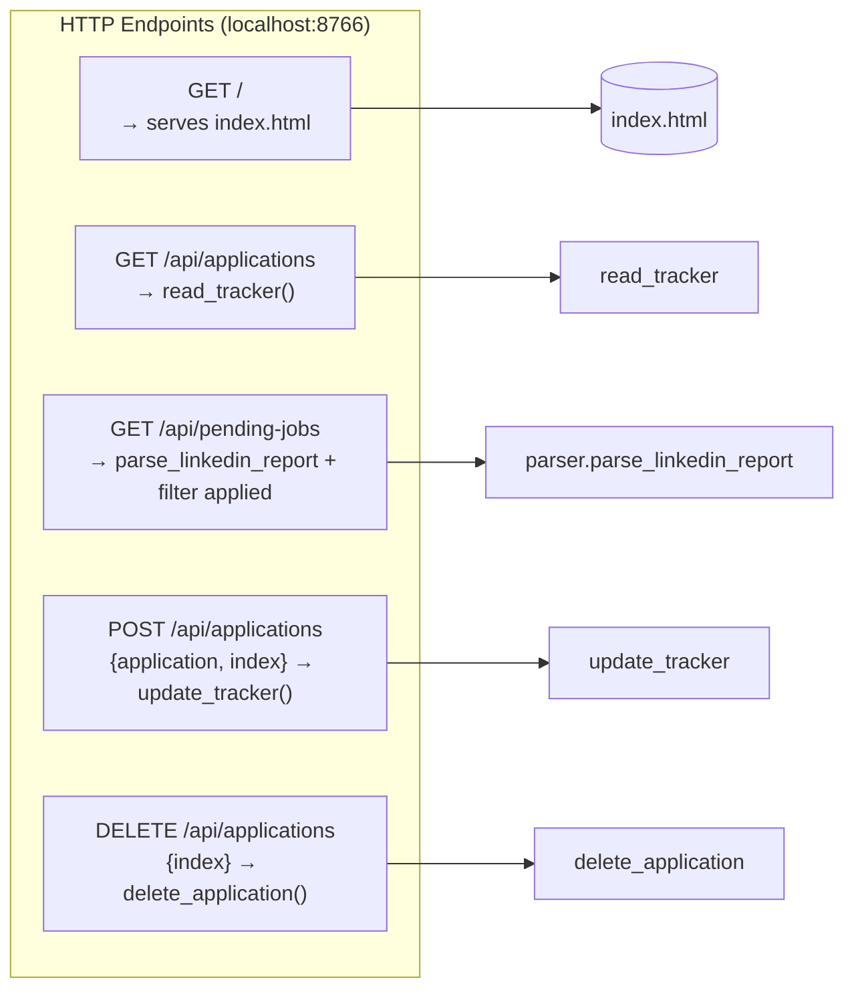
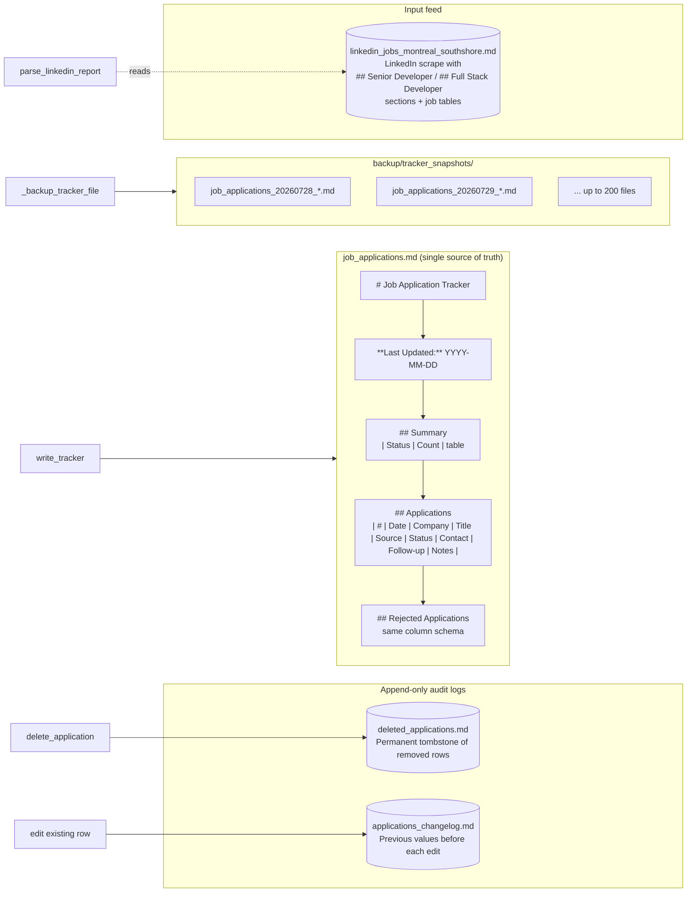
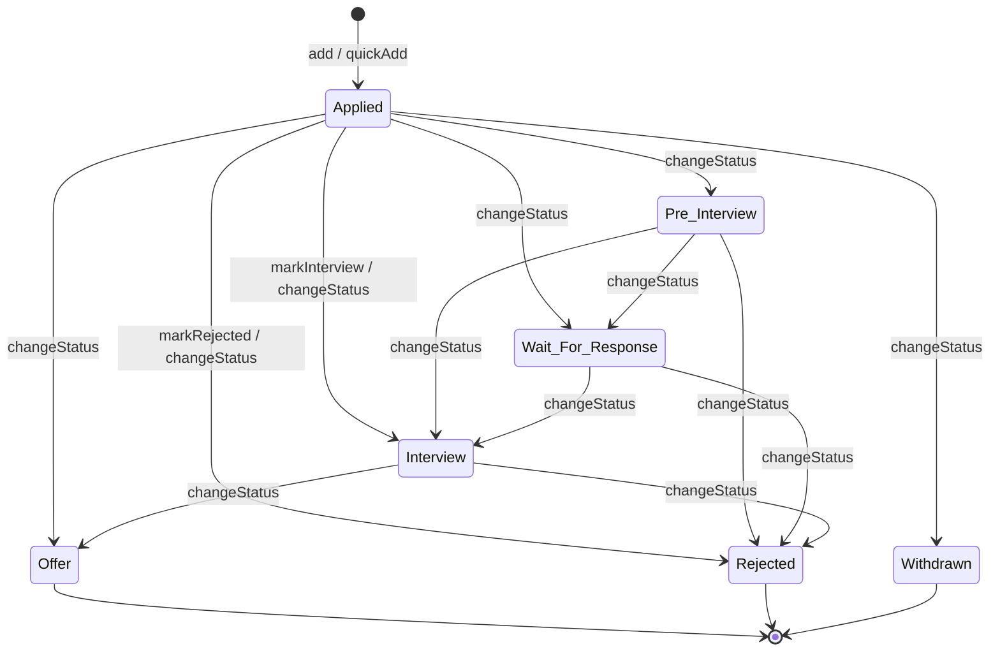

# Job Tracker — Architecture

A Mermaid.js flowchart describing the major components, the API gateway, the
markdown-as-database layer, and the end-to-end data flow.

## Process / Deployment Topology

```mermaid
flowchart TB
    subgraph Client["Client Tier (Browser)"]
        UI[index.html<br/>Vanilla JS SPA<br/>Stats, Tables, Modals]
        LS[(localStorage<br/>in-memory apps[])]
    end

    subgraph Server["Server Tier (Python, localhost:8766)"]
        ENTRY[HTTPServer<br/>http.server.HTTPServer]
        ROUTER[TrackerHandler<br/>do_GET / do_POST / do_DELETE]
        AUTHZ[Security Headers<br/>CSP, X-Frame-Options,<br/>X-Content-Type-Options]
        VAL[Input Validation<br/>JSON parse, enum check,<br/>string sanitization]
        PARSE_REPORT[parser.parse_linkedin_report<br/>Markdown table extractor]
        PARSE_TBL[_parse_tracker_content<br/>Markdown row parser]
        RENDER[write_tracker<br/>Markdown table renderer]
        ARCHIVE[_archive_row<br/>Append-only audit logger]
        BACKUP[_backup_tracker_file<br/>Timestamped snapshot]
        PRUNE[_prune_old_backups<br/>MAX_BACKUPS=200]
        VERIFY[Post-write row-count<br/>verification]
        LOG[server.log<br/>traceback appender]
    end

    subgraph Storage["Storage Tier (Filesystem)"]
        TRACKER[(job_applications.md<br/>Source of truth)]
        REPORT[(linkedin_jobs_montreal_southshore.md<br/>LinkedIn scrape input)]
        DELETED[(deleted_applications.md<br/>Append-only archive)]
        CHANGELOG[(applications_changelog.md<br/>Append-only edit log)]
        SNAPSHOTS[(backup/tracker_snapshots/<br/>job_applications_YYYYMMDD_HHMMSS_ffffff.md)]
    end

    subgraph Launcher["Launcher"]
        RUN[run.sh<br/>python job_tracker_server.py]
    end

    RUN --> ENTRY
    ENTRY --> ROUTER
    ROUTER --> AUTHZ
    ROUTER --> VAL
    ROUTER --> LOG
```

## API Surface (Gateway → Handler)



## Read Path — `GET /api/applications`

```mermaid
flowchart TD
    A[Browser calls loadData] --> B[fetch GET /api/applications]
    B --> C{TrackerHandler.do_GET}
    C --> D[read_tracker]
    D --> E[os.path.exists TRACKER_FILE]
    E -->|no| F[Return empty shell<br/>applications=[], activeApplications=[], ...]
    E -->|yes| G[Read job_applications.md]
    G --> H[_parse_tracker_content]
    H --> I[Build apps list from<br/>## Applications + ## Rejected Applications tables]
    I --> J[Partition by status<br/>active vs rejected]
    J --> K[Extract 'Last Updated:' line]
    K --> L[json.dumps and respond 200]
    L --> M[Browser: applications = data.applications]
    M --> N[renderAll → renderStats,<br/>renderAppliedSection, renderRejectedSection,<br/>renderFollowUps, renderSuccessRate]
```

## Read Path — `GET /api/pending-jobs`

```mermaid
flowchart TD
    A[Client requests pending jobs] --> B[GET /api/pending-jobs]
    B --> C[Read job_applications.md]
    C --> D[Scan rows containing 'Applied'<br/>build applied_companies set]
    D --> E[parser.parse_linkedin_report<br/>REPORT_FILE]
    E --> F[Extract **Generated:** date]
    E --> G[Section parser:<br/>## Senior Developer / ## Full Stack Developer]
    E --> H[Per-row: num, fit, title,<br/>company, location, area, posted, link]
    H --> I[normalize_job_link<br/>detect 'Easy Apply']
    I --> J[parse_posted_date<br/>→ date_bucket 0/1/2/3]
    J --> K[Compute area priority<br/>1 South Shore / 2 Montreal /<br/>3 Other / 4 Laval]
    K --> L[Dedupe by company+title<br/>keep better fit / newer post]
    L --> M[Sort by priority asc, fit desc]
    M --> N[Filter: drop companies<br/>in applied_companies set]
    N --> O[Respond jobs[], count, date, report_date]
```

## Write Path — `POST /api/applications` (add or update)

```mermaid
flowchart TD
    A[Form submit / quickAdd /<br/>changeStatus / markInterview /<br/>markRejected] --> B[POST /api/applications<br/>body: {application, index}]
    B --> C[Read Content-Length<br/>reject >1,000,000]
    C --> D[json.loads + UnicodeDecode guard]
    D --> E[Validate types:<br/>application=dict, index=int]
    E --> F[Require company + title]
    F --> G[Status must be in ApplicationStatus enum:<br/>Applied / Pre-Interview / Wait For Response /<br/>Interview / Offer / Rejected / Withdrawn]
    G --> H[clean() each field:<br/>strip pipes/newlines, max length 20-1000]
    H --> I{index >= 0 and < len apps?}
    I -->|yes edit| J[_archive_row CHANGELOG_FILE<br/>'edited previous values']
    I -->|no append| K[apps.append safe_app]
    J --> L[apps index = safe_app]
    K --> L
    L --> M[Sanity: len apps must not shrink]
    M --> N[update_tracker → write_tracker]
    N --> O[_backup_tracker_file]
    O --> P[shutil.copy2 → backup/tracker_snapshots/<br/>job_applications_YYYYMMDD_HHMMSS_ffffff.md]
    P --> Q[_prune_old_backups<br/>keep newest MAX_BACKUPS=200]
    Q --> R[Build markdown:<br/>Summary table + Active + Rejected sections]
    R --> S[Write to TRACKER_FILE.tmp<br/>flush + os.fsync]
    S --> T[_parse_tracker_content on temp<br/>verify row count matches expected]
    T -->|mismatch| X1[Delete tmp, raise RuntimeError<br/>real file untouched]
    T -->|match| U[os.replace tmp → TRACKER_FILE<br/>atomic on same filesystem]
    U --> V[Respond {"status":"ok"}]
    V --> W[Browser loadData → re-render]
```

## Delete Path — `DELETE /api/applications`

```mermaid
flowchart TD
    A[User confirms delete] --> B[DELETE /api/applications<br/>body: {index}]
    B --> C[Read Content-Length<br/>reject >10,000]
    C --> D[json.loads + guards]
    D --> E[index must be int]
    E --> F[read_tracker → confirm 0 <= index < apps_count]
    F --> G[delete_application]
    G --> H[Snapshot apps, original_count]
    H --> I[Capture row_to_remove]
    I --> J[_archive_row DELETED_LOG<br/>'deleted' — APPEND-ONLY, fsync]
    J --> K[apps.pop index]
    K --> L[Assert apps shrank by exactly 1]
    L --> M[write_tracker<br/>backup → tmp → verify → os.replace]
    M --> N[Respond {"status":"ok"}]
    N --> O[Browser loadData → re-render]
```

## Storage Layer — Markdown-as-Database



## Application Status State Machine



## Cross-Component Data Flow Summary

```mermaid
flowchart LR
    subgraph IN["Inputs"]
        USER[User via browser UI]
        LI[LinkedIn scrape<br/>linkedin_jobs_montreal_southshore.md]
    end

    subgraph PROC["Processing"]
        UI2[index.html<br/>fetch + render]
        SRV[job_tracker_server.py<br/>TrackerHandler]
        P[parser.py<br/>parse_linkedin_report<br/>extract_skills_from_title]
    end

    subgraph OUT["Outputs"]
        APP[Applications table]
        PEND[Pending jobs view<br/>excluding already-applied]
        LOG2[server.log tracebacks]
        AUDIT[deleted_applications.md +<br/>applications_changelog.md]
        BK2[backup/tracker_snapshots/*.md]
    end

    USER -->|clicks / types| UI2
    UI2 -->|GET / POST / DELETE JSON| SRV
    LI --> P
    P -->|jobs, report_date| SRV
    SRV -->|{applications, active, rejected, lastUpdated}| UI2
    SRV -->|jobs[]| UI2
    SRV --> APP
    SRV --> PEND
    SRV -->|traceback| LOG2
    SRV -->|archived row| AUDIT
    SRV -->|shutil.copy2| BK2
    UI2 -->|rendered HTML| USER
```

## Key Design Notes (from the source)

- **No SQL, no ORM.** Persistence is a single markdown file
  (`job_applications.md`) plus append-only audit logs. Writes go through
  `tmp → fsync → re-parse verify → os.replace` so a crash mid-write never
  corrupts the live file.
- **No-data-loss policy.** Every edit and every delete first appends the
  affected row (previous values for edits, the row itself for deletes) into
  a permanent markdown log under `backup/`-adjacent files. The destructive
  write only proceeds if that archive write succeeds.
- **Backups are versioned and capped.** Before each write, the current
  tracker is copied to `backup/tracker_snapshots/` with a
  `job_applications_YYYYMMDD_HHMMSS_ffffff.md` filename; the directory is
  pruned to the most recent `MAX_BACKUPS=200` files.
- **Security headers on every response.** `Content-Security-Policy:
  frame-ancestors 'none'`, `X-Frame-Options: DENY`, `X-Content-Type-Options:
  nosniff`. The server binds to `localhost:8766` only.
- **Stateless handler.** The Python `HTTPServer` has no shared in-memory
  state — every request re-reads the markdown file, so concurrent writes
  cannot silently overwrite each other.
- **Browser is untrusted.** All write endpoints validate types, required
  fields, and the `status` value against the `ApplicationStatus` enum, and
  pipe/newline characters in user input are stripped to keep the markdown
  table well-formed.
- **Parser is isolated.** `parser.py` is a pure module — it only reads
  `REPORT_FILE` and returns `(jobs, report_date)`. It also exposes
  `extract_skills_from_title` / `normalize_title` for the Quebec bilingual
  market (accent stripping, FR/EN matching).
